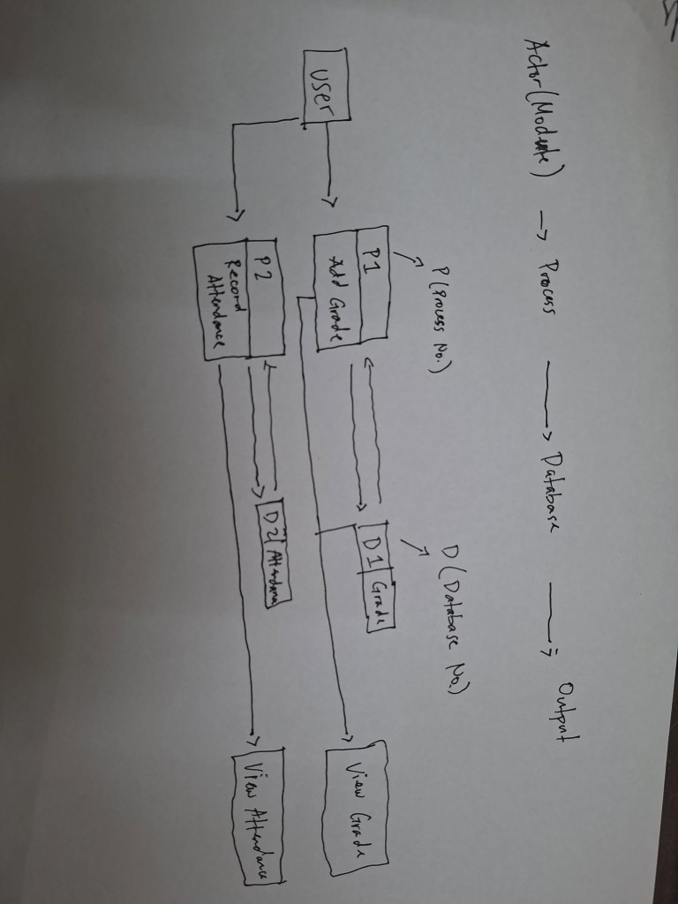

# LARIOSA App Development Documentation

## Data Flow Diagram (Level 1)

The following Level 1 DFD matches the diagram you attached.



## System Requirements

### Software Requirements

- Mobile app: React Native `0.83.1`
- State management: Redux `9.x`, Redux-Persist `6.x`, Redux-Saga `1.4.x`
- Styling/UI: NativeWind `4.x` (Tailwind CSS for RN)
- Auth: Google Sign-In (`@react-native-google-signin/google-signin`)
- Backend API:
  - Symfony JSON API hosted under an `/api` prefix
  - The app uses JWT (passed as `Authorization: Bearer <token>`)
- Supported auth endpoints used by the app:
  - `POST /api/login` (email/password)
  - `POST /api/login/google` (Google ID token)
  - `POST /api/register`
  - `GET /api/me` (current user profile)
- Supported booking endpoints used by the app:
  - `GET /api/test-drive-bookings` (optionally `?status=pending|approved|rejected|completed`)
  - `GET /api/test-drive-bookings/{id}`
  - `POST /api/test-drive-bookings`
  - `PATCH /api/test-drive-bookings/{id}`
  - `DELETE /api/test-drive-bookings/{id}`

### Hardware Requirements

#### Test Device (provided)

- Test Device: `PropertyDetailsModelXiaomi 11T`
- Model Number: `21081111R`
- Codename: `Agate`
- Released: `October 6, 2021`
- Platform: `Android 11 (upgradeable)`
- Chipset: `MediaTek Dimensity 1200 (MT6893)`
- Architecture: `64-bit, Octa-core, 6nm`
- GPU: `ARM Mali-G77`
- RAM: `8 GB`
- Storage: `128 GB / 256 GB`
- Display:
  - Size: `6.7 inch`
  - Resolution: `1080 x 2400 px`
  - Type: `AMOLED`
  - Notch: `Punch-hole (center)`
- Connectivity:
  - Network: `5G, 4G, 3G, 2G`
  - NFC: `Yes (NFC-A, NFC-B)`
  - IR Blaster: `Yes`
  - GPS: `Yes (NMEA 0183)`
  - Bluetooth: `Yes`
  - Wi-Fi: `Yes`
- Sensors:
  - Fingerprint: `Yes (side-mounted)`
  - Proximity: `Yes`
  - Light: `Yes`
  - Barometer: `Yes`
- Camera:
  - Main: `108 MP`
  - Ultra-wide: `8 MP`
  - Macro: `5 MP`
  - Front: `16 MP`
- Battery:
  - Capacity: `5000 mAh`
  - Charging: `67W fast charging`

## User Guide

### 1) Launching the App

1. Open the `LARIOSA` mobile app.
2. If not authenticated, you will see the authentication flow.

### 2) Signing In / Creating an Account

1. Go to the `Login` screen.
2. Choose one of the following:
   - `Sign in` using:
     - Email address
     - Password
   - `Sign in with Google`:
     - Google Play Services must be available on the device.
3. If you do not have an account, select `Sign up` and create one using:
   - `fullName`
   - `email`
   - `password`

### 3) Browsing Vehicles (Inventory)

1. Open the `Inventory` screen.
2. Use:
   - Search (brand/model/conditions text search)
   - Filter by vehicle type (e.g., Sedan/SUV/Truck/Hybrid/Electric)
3. Select a vehicle to view its details (vehicle detail screen).

### 4) Booking a Test Drive

1. From the `Appointments` screen, select `Test drive`.
2. Choose the vehicle and enter:
   - Requested date and time (using the date/time picker)
   - Optional notes
3. Submit the booking request.
4. The app submits the booking via the backend and updates the UI based on the server response.

### 5) Viewing Appointments

1. Open the `Appointments` screen.
2. Appointments are grouped and filtered (chips):
   - `All`
   - `Service`
   - `Test drives`
3. The screen shows:
   - status badges
   - date/time
   - notes (when available)
4. Pull-to-refresh is available on supported screens.

### 6) Managing Bookings (Cancel/Delete + Detail Updates)

1. Open a booking from the list to view details.
2. For test drives:
   - You can cancel/delete only when the booking is modifiable (e.g., typically `pending`).
3. The detail screen polls periodically to refresh status:
   - Poll interval: `8000ms`
4. When deleting/cancelling:
   - A confirmation dialog is shown to prevent accidental removal.

## Technical Documentation

### Installation

1. Prerequisites:
   - Node.js >= `20`
   - npm (comes with Node.js)
   - React Native development environment for your target platform:
     - Android: Android Studio + Android SDK + a working emulator or physical device
     - iOS: macOS + Xcode (physical device or simulator)
2. Install dependencies:
   ```sh
   npm install
   ```

### Setup

#### 1) Configure API Environment

The app’s backend base URL is controlled in:
- `src/app/config/api.ts`

Update these values to match how you run the backend:

- `ENVIRONMENT`:
  - `PRODUCTION`: Railway/LAN Symfony server in production
  - `NETWORK`: local LAN IP (physical device on the same Wi-Fi)
  - `ANDROID_EMULATOR`: `http://10.0.2.2:8000`
  - `IOS_SIMULATOR`: `http://localhost:8000`
- `LOCAL_NETWORK_IP`: set to your PC LAN IP when using `ENVIRONMENT = 'NETWORK'`

If the app cannot reach the server, requests will fail with an error that points you to check:
- the Symfony server is running
- the `ENVIRONMENT` setting matches your device
- the Postman base URL uses the same host/port

#### 2) Google Sign-In Configuration

Google Sign-In uses a configured `webClientId` in:
- `App.tsx`

If you change your Firebase/Google project, update:
- `GoogleSignin.configure({ webClientId: '...' })`

### Running the App

#### Android

```sh
npm run android
```

#### iOS (macOS only)

```sh
npm run ios
```

### Architecture / Runtime Notes

- Network layer:
  - Uses `fetch` with a request timeout (`~45s`)
  - Automatically retries certain GET requests on network failure (except `/login`)
- Authentication:
  - JWT is attached as `Authorization: Bearer <token>`
  - Logout clears the local token (server logout API is currently a stub returning `{ success: true }`)
- Persistence:
  - Redux state is persisted with `redux-persist` to `AsyncStorage`
  - The app whitelists `auth` for persistence (user + tokens)
- Bookings refresh behavior:
  - Bookings list and booking details use polling to keep appointment status up to date (`8000ms` interval)

